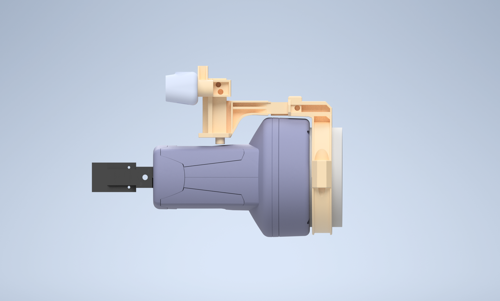

# AutoClean

Project at Deggendorf Institute of Technology for the automating the post-processing of 3D-printed plants.
The parts are printed with HP MJF (Multi-Jet Fusion).

## Description

  
  
<strong>Fig. 1: Automation Setup.</strong>

The post-processing line consists of a robot-centered layout, with four stations:
1. **Vibrating plate**: to remove bulk powder.
2. **Sandblasting**: to remove fine powder.
3. **Inspection**: for quality check and sorting.
4. **Sorting**: automated sorting according to requirements.

The section [process control](#process-control) illustrates the different stages.

A six-axis manipulator (UR5e) is used for handling of parts from station to station.
A two-finger gripper with a dotted surface made from TPU ensures increased grasping capability with powder printed parts.

An RGBD (Intel RealSense d435i/d405 depth-camera) is used for recognizing images and depth.
The RGBD camera is mounted on the wrist of the 6-axis manipulator.
The detection of edge algorithm is available at [edge-grasp-pose-detection](https://github.com/thd-research/edge-grasp-pose-detection).

## Repository Structure:

Key directories within this repository:

- **`autoclean/`**
    - **`scripts/`**: [scripts](scripts/) for running the automation line.
        - **`tools/`**
            - **`ur_realtime.py`**: [script](scripts/tools/ur_realtime.py) for robot control via python-rtde
            - **`sps.py`**: [script](scripts/tools/sps.py) for plc control via python-snap7
        - **`main.py`**
    - **`cad_files/`**: [cad data](cad_files/).
        - **`camera_holder/`**: [custom camera holder ](/cad_files/camera_holder/) for the autoclean project.
        - **`gripper_fingers/`**: [custom gripper fingers ](/cad_files/gripper/final_models/gripper_fingers/) for grasping powder-coated parts.
    - **`.gitsync.sh`**
    - **`README.md`**

## Mechanical components:

Several assemblies were used for simulation.
Key components we have developed which can be 3D-printed include the gripper fingers and [camera holder](/cad_files/camera_holder/).

  
  
<strong>Fig. 2: Schunk Co-Act egp-c 40 gripper with custom fingers and camera mount.</strong>

The camera mount allows translational change in position which fits the best field of view for the camera.

  
  
<strong>Fig. 3: Side view: camera holder for standard static FOV of depth camera d435.</strong>

  
  
<strong>Fig. 4:  Side view: camera holder extended for new FOV of depth camera d435.</strong>

  
  
<strong>Fig. 5: Gripper fingers closeup.</strong>

## Process control:

The scripts follow a specific control algorithm based on the material flow and layout of the automation line.
Additionally, YOLO CNN (image detection neural network) from Darknet is used for detection of edges in our [pipeline](https://github.com/thd-research/edge-grasp-pose-detection).

  
  
<strong>Fig. 6: Robot centered layout in AutoClean.</strong>

  
  
<strong>Fig. 7: Automation schematic showcasing material flow.</strong>

  
## Acknowledgement
To complement the publication titled "6D edge pose detection for powder-printed parts using Convolutional Neural Networks and point cloud processing"(awaiting publication on IEEE Xplore), so that the experimental trials, as well as results are made available and can be reproduced independently. This work has been completed by several researchers at the DIT and crediting us for any use of the material here would be very much appreciated.
